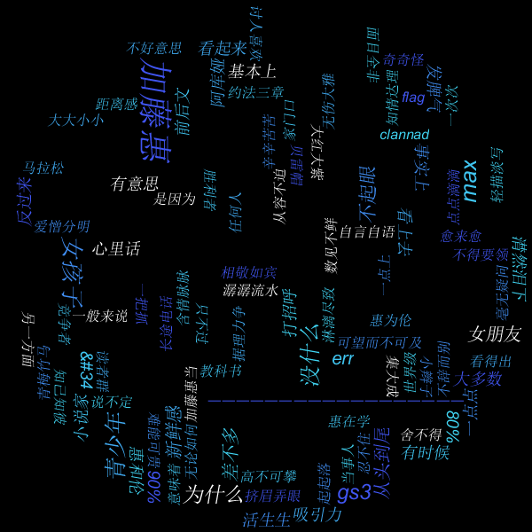

爬取知乎下面的回答，制成词云

本项目使用了以下两个项目：

[webmagic](https://github.com/code4craft/webmagic) 一个java爬虫框架

[kumo](https://github.com/kennycason/kumo) java词云工具，支持中文分词

以抓取知乎提问[加藤惠的人设为什么如此出色？](https://www.zhihu.com/question/63201551/answer/2366955953)为例，生成的词云图片为：

